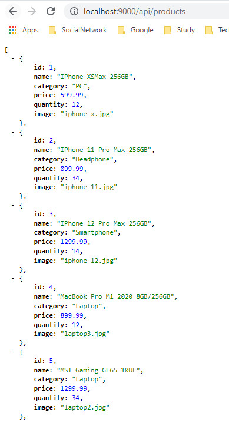
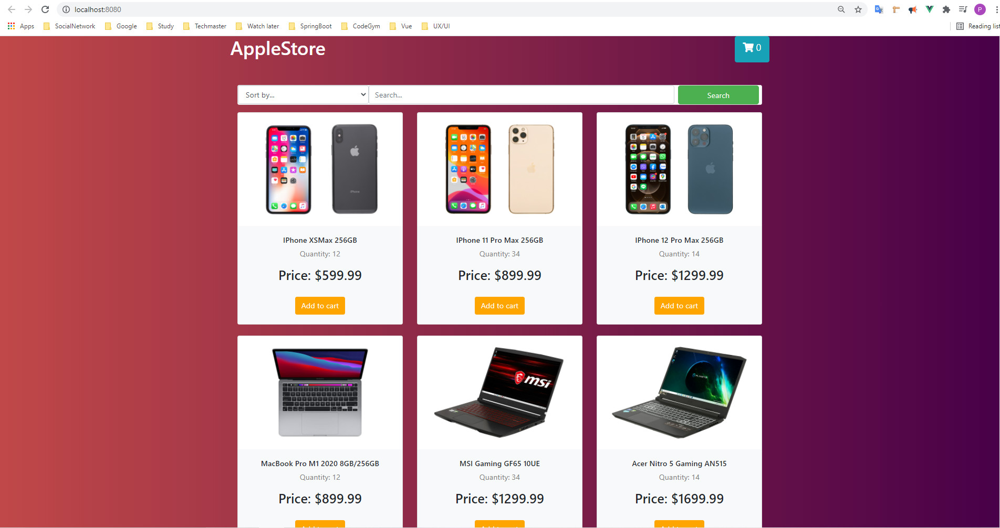
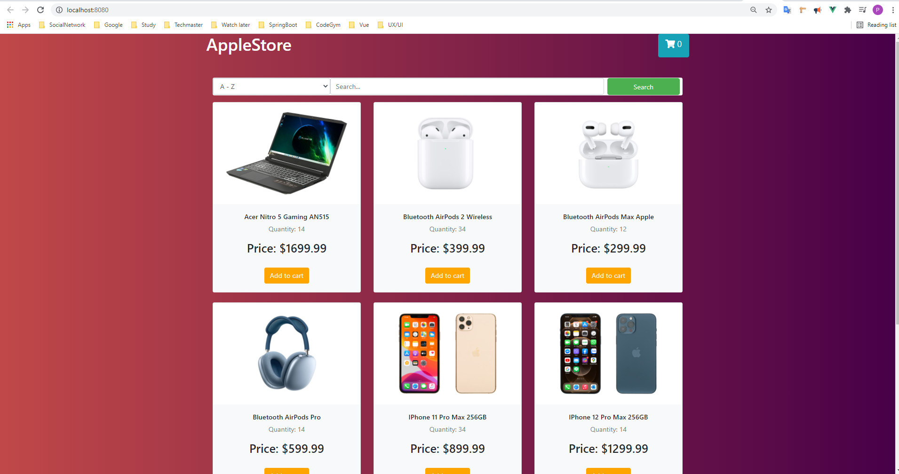
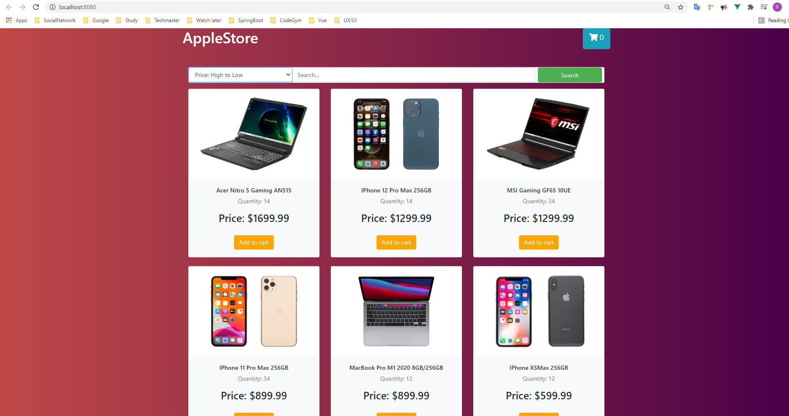
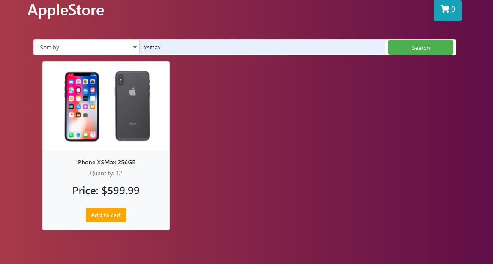
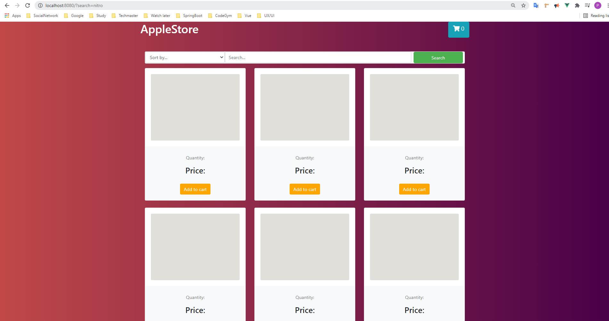

# REST API SPRINGBOOT AND VUE 

## Springboot: 

### Hứng tại cổng 9000 ta được kết quả như sau ở cổng 9000

http://localhost:9000/api/products

## Vue:

### Hứng tại cổng 8080 và lắng nghe server tại cổng 9000

#### Kết quả render nhận được như sau

#### Sắp xếp theo tên: 

#### Sắp xếp theo giá: 

### Tìm kiếm: 

### Màn hình loading:  

